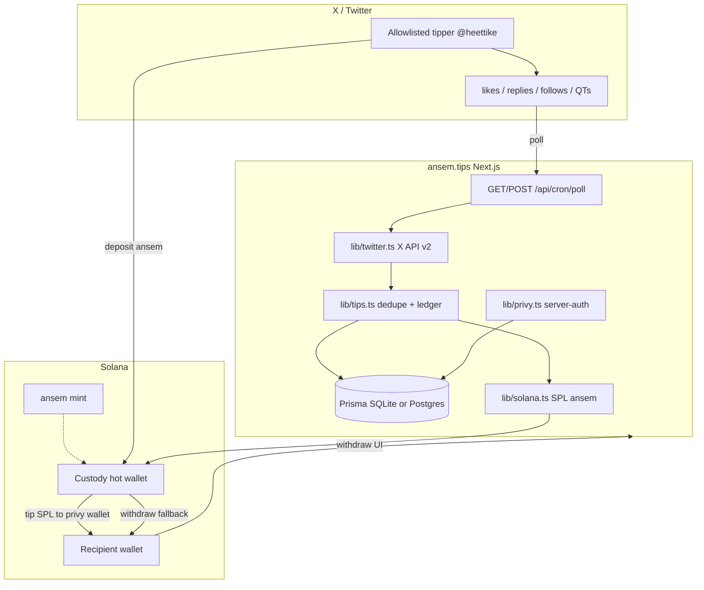

# ansem.tips

Production Next.js app that tips **$ansem** on Solana when an allowlisted tipper likes, replies, follows, or quote-tweets on X. Comments/QTs containing the bull emoji upgrade to a **super-tip**.

**Tippers:** `@heettike`, `@blknoiz06`, `@srijancse` (via `TIPPER_ALLOWLIST`)
**Trial tipper:** `@heettike`
**Mint:** `9cRCn9rGT8V2imeM2BaKs13yhMEais3ruM3rPvTGpump`
**Gratitude wallet:** `G4uHQ85j65KBsypPH6qVqoiSYUBuH9YTAqRpuhjLRJBq`

`DEMO_MODE` is an **explicit fallback** when credentials are missing or `DEMO_MODE=true`. With Privy, X, and hot-wallet env vars set, the live code paths run.

---

## Architecture

### Tip pipeline
hi

1. **Poll** X actions for TIPPER_X_USERNAME via /api/cron/poll (or the poll script).
2. **Dedupe** with unique ProcessedAction.actionId.
3. **Enqueue** Tip rows using TipSettings amounts (bull emoji upgrades to super_tip).
4. **Process** provision a Privy Solana wallet for the recipient (keyed by X user id), then SPL $ansem from the hot wallet to **that** address.
5. **Ledger** debit tipper `deposited` and bump lifetime sent/received. Withdrawable stays 0 when the chain send lands. If Privy create or SPL fails, credit withdrawable so they can cash out on login.
6. **Withdraw** leftover withdrawable (failed on-chain tips only) via /api/withdraw. Recipients already holding tokens in their Privy wallet send out from that wallet.

---

## Custody model

| Role | Funds | Mechanism |
|------|--------|-----------|
| Tipper | Deposits \$ansem into their Privy wallet | Deposit watcher credits Balance.deposited |
| Tip | On-chain SPL to recipient Privy wallet | Hot wallet → provisioned Privy Solana address; debit deposited |
| Recipient | Already has tokens in Privy wallet | X login matches the pre-created twitter user; leftover withdrawable uses /api/withdraw |
| Platform | Hot wallet key | HOT_WALLET_SECRET (base58) — never commit |
| Gratitude | Culture fund address | GRATITUDE_WALLET (no product token) |

Tips send only to the Privy address we provisioned — never a self-reported wallet. Chain sigs are real Solscan signatures. Failed create/transfer credits withdrawable as the only fallback.
## Quick start

---

## Quick start

1. Copy env example file to .env and fill production credentials.
2. Install JS dependencies.
3. Push the database schema.
4. Start the Next.js development server.
5. Open http://localhost:3000

### Package scripts

| Script | Purpose |
|--------|---------|
| dev | Next.js development server |
| build / start | Production build and serve |
| db:push | Push Prisma schema |
| db:studio | Prisma Studio |
| poll | Local poll and process loop |

---

## Environment setup

Copy `.env.example` to `.env`. Keys are uncommented with empty or default values.

Required for production:

- DATABASE_URL (SQLite file locally; Postgres in prod)
- CRON_SECRET (bearer for cron poll route)
- TIPPER_ALLOWLIST / TIPPER_X_USERNAME (default heettike,blknoiz06,srijancse)
- ANSEM_MINT, GRATITUDE_WALLET, SOLANA_RPC_URL
- HOT_WALLET_SECRET (base58; never commit)
- NEXT_PUBLIC_PRIVY_APP_ID, PRIVY_APP_SECRET
- TWITTER_BEARER_TOKEN

Optional: DEMO_MODE, NEXT_PUBLIC_DEMO_MODE, HOT_WALLET_ADDRESS, ANSEM_DECIMALS, MIN_DEPOSIT_USD, MIN_TIP_USD

Without X/Privy/hot-wallet credentials, those subsystems fall back to mocks automatically.

---

## API surface

| Route | Method | Auth | Description |
|-------|--------|------|-------------|
| /api/cron/poll | GET/POST | Bearer CRON_SECRET (skipped in DEMO_MODE) | Deposits + poll X + process tips |
| /api/cron/deposits | GET/POST | Bearer CRON_SECRET | Credit tipper Privy wallet  deltas |
| /api/tips/process | GET/POST | none | Process pending tips |
| /api/tips/settings | GET/POST | Privy bearer | Read/save tipper amounts |
| /api/balance | GET | none | Ledger balances |
| /api/withdraw | POST | none | SPL payout from hot wallet |
| /api/deposit | GET/POST | Privy bearer on POST | Deposit instructions / credit ledger |
| /api/auth/sync | POST | Privy bearer | Upsert user from X + Solana wallet |

Call the cron route with an Authorization Bearer header equal to CRON_SECRET.

---

## Pages

- / — dark crypto landing (mint + gratitude links)
- /onboard — Privy X login, deposit address, tip settings
- /dashboard — tipper balances + recent tips + poll
- /withdraw — recipient earned balance + SPL withdraw

---

## Production checklist

1. Set Postgres DATABASE_URL and push the Prisma schema.
2. Configure Privy with Twitter login and Solana embedded wallets.
3. Fund hot wallet with ansem token + SOL for fees; set HOT_WALLET_SECRET.
4. Set X API bearer with liked tweets / recent search / following access.
5. Keep vercel.json daily cron on /api/cron/poll (Hobby 1/day); overnight agent may hit poll+deposits more often.
6. Keep DEMO_MODE unset or false.

---

## Stack

Next.js 16 · React 19 · Prisma · Privy · Solana web3.js + spl-token · Tailwind 4 · Zod

## One-login tipper flow (no pasted X tokens)

1. Tipper (e.g. @blknoiz06) clicks Continue with X on /onboard.
2. Privy X OAuth runs. Client useOAuthTokens captures access+refresh tokens and POSTs them to /api/auth/sync with the Privy bearer. Never ask the tipper to paste X user tokens.
3. Server stores twitterAccessToken / twitterRefreshToken / twitterTokenExpiresAt on User, plus Privy Solana walletAddress.
4. Tipper sends SPL $ansem (Token-2022) to their Privy wallet. /api/cron/deposits (or daily /api/cron/poll) credits Balance.deposited for positive deltas.
5. Poller uses stored user-context tokens for liked_tweets; falls back to app bearer where allowed.
6. Recipient withdraws use HOT_WALLET_* only — fund hot wallet with $ansem + SOL for fees; no fake withdraws.

**Privy dashboard (required):** Login Methods → Twitter → custom OAuth creds + toggle **Return OAuth tokens**. Scopes: tweet.read users.read like.read offline.access follows.read. Server-auth getUser does **not** return provider tokens today.

**Vercel Hobby cron (1/day):** /api/cron/poll at `30 20 * * *` also runs deposits. Overnight agent can hit /api/cron/deposits and poll more often — do not add */5 Hobby crons.
